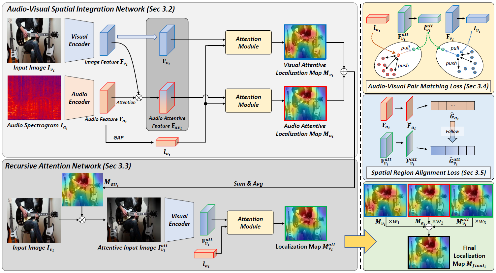

# Audio-Visual Spatial Integration and Recursive Attention for Robust Sound Source Localization (SIRA-SSL)
The Official PyTorch Implementation of the paper "Audio-Visual Spatial Integration and Recursive Attention for Robust Sound Source Localization". <br/>

Accepted at [ACMMM 2023](https://www.acmmm2023.org/): <br/>

[Paper] [[arXiv](https://arxiv.org/abs/2308.06087)]

## Abstract

The objective of the sound source localization task is to enable machines to detect the location of sound-making objects within a visual scene. While the audio modality provides spatial cues to locate the sound source, existing approaches only use audio as an auxiliary role to compare spatial regions of the visual modality. Humans, on the other hand, utilize both audio and visual modalities as spatial cues to locate sound sources. In this paper, we propose an audio-visual spatial integration network that integrates spatial cues from both modalities to mimic human behavior when detecting sound-making objects. Additionally, we introduce a recursive attention network to mimic human behavior of iterative focusing on objects, resulting in more accurate attention regions. To effectively encode spatial information from both modalities, we propose audio-visual pair matching loss and spatial region alignment loss. By utilizing the spatial cues of audio-visual modalities and recursively focusing objects, our method can perform more robust sound source localization. Comprehensive experimental results on the Flickr SoundNet and VGG-Sound Source datasets demonstrate the superiority of our proposed method over existing approaches.



## Environment

***Will be updated soon.***

<strike>

Setup with Anaconda

```bash
conda env create -f environment.yml
```

Setup with Poetry

```bash
poetry install
```
</strike>

## Dataset

### Flickr SoundNet

Download the Flickr SoundNet dataset from [here](https://github.com/ardasnck/learning_to_localize_sound_source)

### VGG-Sound Source

Download the VGG-Sound Source dataset from [here](https://github.com/hche11/VGGSound)

### Preprocess

***Will be updated soon.***

## Training

### Modify train.sh

```bash
trainset="dataset_to_train"
testset="dataset_to_test"
train_data_path="path_to_trainset"
gt_path="path_to_ground_truth"
etc...
```

### Run train.sh

```bash
./train.sh
```

## Evaluation

### Modify test.sh

```bash
testset="dataset_to_test"
test_data_path="path_to_testset"
gt_path="path_to_ground_truth"
etc...
```

### Run test.sh

```bash
./test.sh
```

## Citation

If you find this code useful for your research, please cite our paper:

```
***Will be updated soon.***
```

## Acknowledgement
Our code is based on [Attention](https://github.com/ardasnck/learning_to_localize_sound_source), [HardWay](https://github.com/hche11/Localizing-Visual-Sounds-the-Hard-Way), [HearTheFlow](https://github.com/denfed/heartheflow). We thank the authors for their great work and sharing the code.